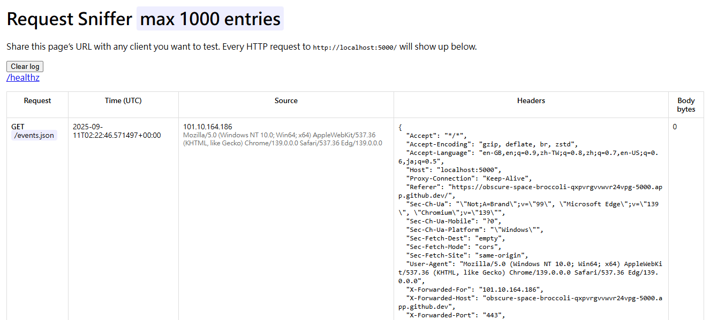

# Copilot Request Detector



This is a simple Flask-based server designed to help you detect whether GitHub Copilot (or any other automated tool) sends HTTP requests to a given URL. It logs incoming requests with the client's IP address and timestamp.

## 🧠 Purpose

You can use this server to:
- Test if Copilot accesses external URLs during code generation or suggestion.
- Monitor request activity from any client.
- Log basic request metadata for analysis.

## 🚀 How to Deploy on GitHub Codespaces

```
python3 -m venv .venv
source .venv/bin/activate
pip install -r requirements.txt
python app.py
```

1. **Create a GitHub repository** and name it `copilot-request-detector`.
2. **Add the following files**:
   - `app.py` (see below)
   - `requirements.txt`

3. **Install dependencies**:
   ```bash
   pip install -r requirements.txt
   ```
